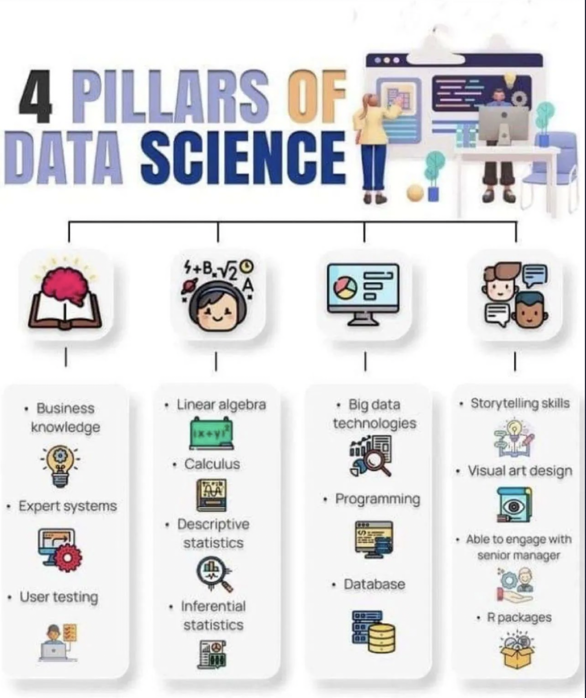

# Telling Stories with Data
In Fall 2023 I led a course on digital storytelling. In preparing for the course, I wanted to see what others were doing, and so I searched for course listings, tracked down syllabi, and compared assignments and foci. It was fascinating to see the range of things being done. One thing that I did not fully expect was how often a search for "digital storytelling" washed me up on data science beaches. The graphic below tells the story, but I also want to collect more links to see what I can learn. (*See the list below*.)

- [MIT Sloan School of Management: Communicating Data Through Storytelling](https://mit-online.getsmarter.com/presentations/lp/mit-sloan-communicating-data-through-storytelling-online-short-course/).