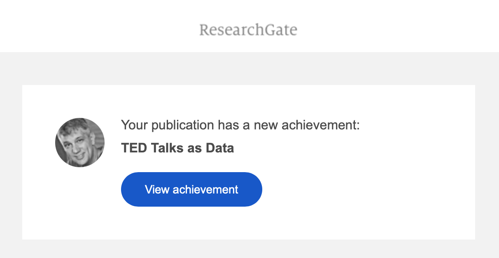
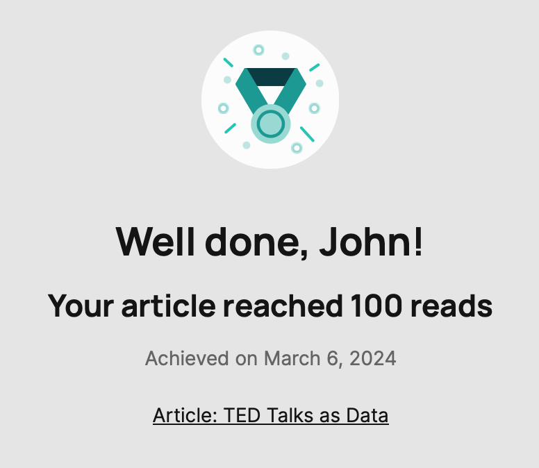

A few months ago I mused elsewhere online that *civilization would end in portals*. That observation came after a period of travel in which I had not only to wade through my own organization’s portal but another organization’s portal. And I had both applied for a few jobs as well as submitted recommendations for students and colleagues, and I was *portaled* out. Some organizations were renting their portal from the same vendor, and so it would both recognize you and not recognize you. Somewhere in Dante’s inferno, there are portals. I am sure of it.

It’s not clear to me how much value portals bring to any organization except the appearance for management of “having done something.” This kind of check-box-ism is, of course, the first and last resort for the kinds of managers who can slow a good organization, trip a decent organization, and appear to flock to bad organizations, who, being bad organizations, cannot discern between good and bad management.

So far as I can tell, when it comes to portals, the logic of such management appears to be “the more the better.” And hapless employees are then forced to sign onto and off a variety of portals just to get the basics done. One portal for travel management. Another for travel reimbursement. Another for health records. Another by the insurer. Another by the hospital or medical provider. Yet another portal for performance evaluation.

None of these portals talk to each other, and so the chief task of the employee or patient appears to be to enter the same data over and over and over again all while juggling multiple login identities and a variety of password parameters — this site requires symbols; this site rejects symbols — and captchas — because who hasn’t fulfilled their lifetime quota of clicking on tiles that contain fire hydrants?

And none of this applies to the portals as platforms to which we subscribe which create similar amounts of drudgery for us. Take, for example, a recent interaction from ResearchGate, which emailed me the following:

And when I clicked on the link in the email, it took me to this page:

There is no reason, absolutely no reason, that that information could not have been in the original email. And if it was, I would be appreciative of the lack of friction ResearchGate offers me. Instead, I clicked, and had to log in!, only to learn this rather small fact. 

From some manager’s point of view, they have created engagement. From my point of view, they’ve taken something decent and good and *portalized* it. 