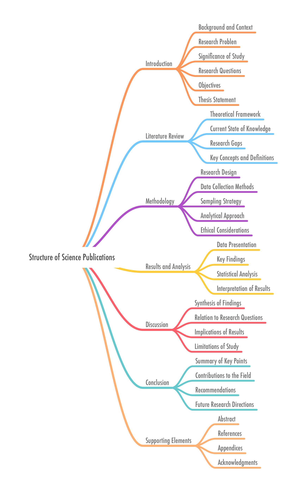

I have over the past two decades teaching in university settings regularly been called upon to teach either a specialized research methods for folklore studies or one for all the domains represented in an English department, from the very science-oriented field of linguistics to the belletristic domains of creative writing (*sigh*) and some of literary studies. I also regularly teach undergraduate courses, and graduate courses, that feature a research project whose end goal is a research paper aka scholarly essay or article aka term paper. 

While I myself do not find the rather regimented nature of science writing to be the kind of writing I wish to do in all my essays, I have found it useful to master as a process to getting good results. That is, if you do all these things, then you have some assurance that you have done competent work. (Its worth or merit or utility will have to be decided by the field into which it is cast, like bread upon a pond surface, or perhaps it’s a lake, depending on the size of the field.)

For my students coming here for the visualization of the structure, the diagram is below. The [OPML file](../assets/struct-science-pub.opml) that goes with it is also available and can be opened in most modern word processors. (I know Word will open it.) Before anyone splutters, obviously how much of this structure you realize depends on the nature and scope of your project. This is an idealized structure. Consider it a guide and not a specification.

