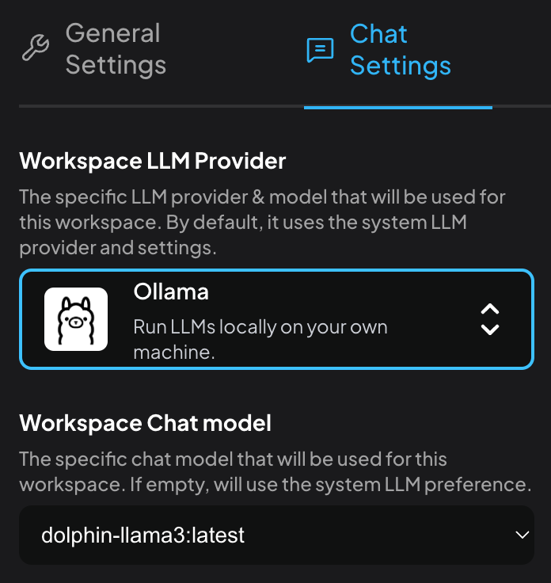

I spent a portion of today following Cody Wabiszewski’s guide on how to [download and run the Dolphin Llama 3 model](https://www.gsnetwork.com/author/cbw50077/). His directions are quite good, but they miss a few things, especially when it comes to setting things up on a Mac. So for those Mac users who want expand the scope of running an LLM locally beyond Apple Intelligence, I suggest the following:

1. Head over to the [Ollama website](https://ollama.com/) to download one of the available models. Wabiszewski recommends **`dolphin-llama3`** and that’s what I went with.

2. You start with the **Ollama.app**. (I’m not crazy about this, but I wanted the friendliest possible way of doing this because I wanted to make this process reproducible for others … a notion that is completely contradicted by the next step … 

3. Once the Ollama app is running, you can then use the terminal to run, in two different tabs!,  `ollama serve` and `ollama run dolphin-llama3`. (The latter command downloads the dolphin-llama3 model, which is about 5GB. Complete information on the model is available on its [Ollama web page](https://ollama.com/library/dolphin3).)

> Now, there is a slight complication: when I downloaded the Dolphin Llama 3 model, it was not located where any of the posts I read suggested. Instead, I needed to use `locate` to find the directory. (If you have not run `locate` before, you will need to let it build its database, but that does not take long -- less than 10 minutes on my M1 MacBook Air with 1TB storage.) Eventually I found it in a hidden directory in my home folder: `./ollama`. (I would eventually like to move that to an unhidden directory dedicated to models, but I left it there for the time being.)

4. Download the [AnythingLLM app](https://anythingllm.com), install it, and then run it. Create a workspace as directed, then click on the setting gear and then the Chat Settings. If ollama serve is running, you should be able to choose it as an option. There are several clickthroughs for this.

Once this is done, you are able to run an LLM locally. (BTW, this one has no guard rails, so be careful what you ask!)