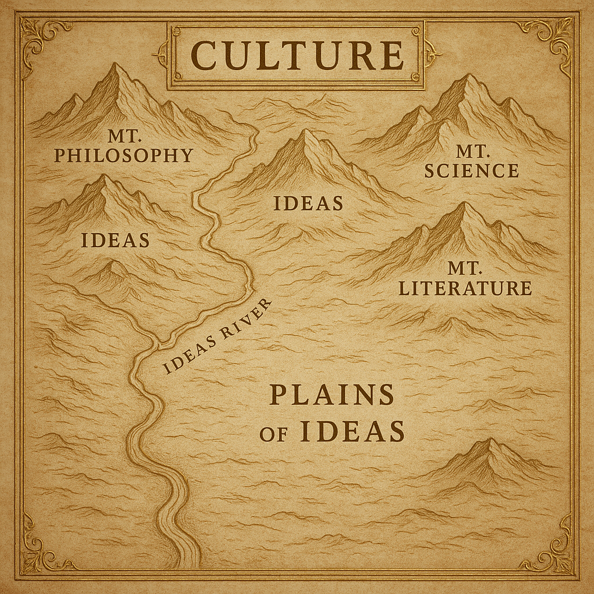

One of the best responses to what AI brings to the table, amidst all the other hand waving or wringing, is [Ted Underwood’s observation](https://tedunderwood.com/2025/07/02/a-more-interesting-upside-of-ai/) that we have an opportunity to use the geometries encoded within the models to map culture. Underwood uses a broad brush here, but implicit in his account, I think, is that the kinds of maps we are talking about are localized: perhaps to a given microculture (or speech community) or perhaps to a given genre.

Take for example the conspiracy theory as a genre: what if we took a base-line transformer, or perhaps a more fully kitted out model, and gave it a corpus of conspiracy theories to digest? Could we then lift up the hood of the transformer and see some of the workings for CTs for ourselves? I am particularly curious how such an effort might reveal patterns we had not noticed or even offered us a synopsis which at first glance doesn’t make sense. As [Farrell et al][] note: “the probability distributions of long word sequences are … imperfect representation[s] of language but contain a surprisingly large amount of information about the patterns [they] summarize” (2025:1154). (Hat tip to Underwood for the reference!)

To be fair, [Farrell et al][] are more interested in large scale analytical possibilities. They note, for example, that “such technologies could be used to find patterns in texts and images that crisscross the space of human knowledge and culture” (1155). As someone with more than a passing interest in recent developments in cultural evolution studies, the ability of LLMs to discern such patterns is very exciting, but I think starting small and focused is perhaps the best place to start. The opportunities for a productive tension between algorithmic results and conventional ways of understanding are terrific here. 

Farrell, Henry et al. 2025. Large AI models are cultural and social technologies. _Science_ 387(1153-1156). DOI:10.1126/science.adt9819.

[Farrell et al]: https://www.science.org/doi/abs/10.1126/science.adt9819