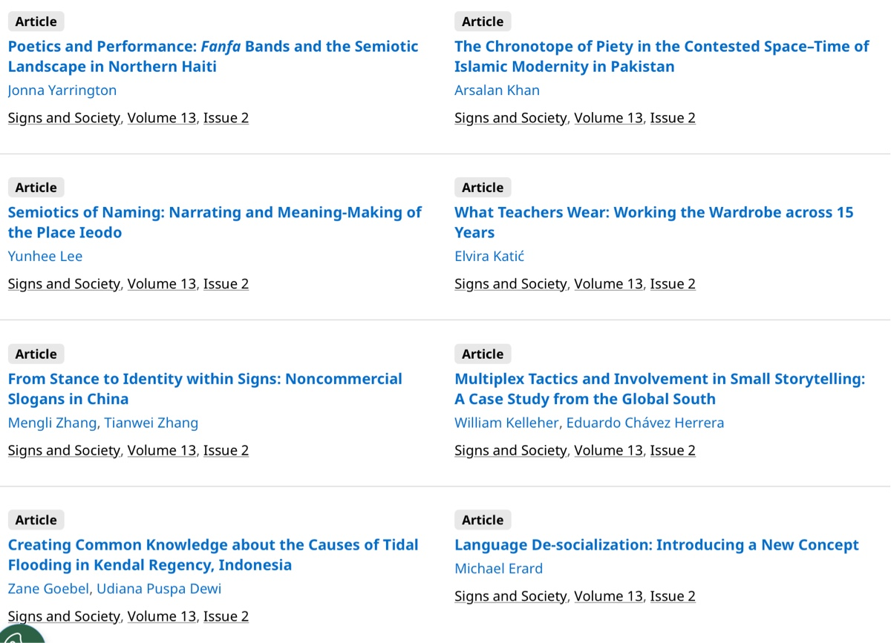

To my mind, there are clear echoes of Mikhail Bakhtin’s *chronotopes* in **text world theory** (see Ernestine Lahey’s terrific encapsulation linked below), and so it was good to see that in the most recent issue of _Signs and Society_ there was an article using chronotopes:

