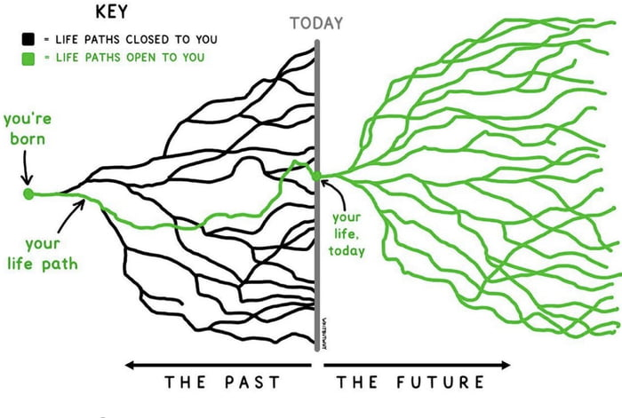

Some time ago I sat down to try to think of a way to visualize how choices work. I sketched out a branching network, much like the image below whose origin I have long forgotten. (My apologies to that creator. And my thanks.) The point I was trying to make, in my head, to my daughter was that, yes, of course certain choices preclude certain possibilities, but none of the branches necessarily are closed in the future. 

Beyond that simple idea, what I was really trying to find a way to articulate, and to visualize, is that certain places offer you more choices, more branches, more paths, than others. One of the things you can aspire to do, if you value having more choices, is to identify these rich nodes in your life path network and to find ways to get there. Is there a school you need to attend? An organization for whom you need to work or volunteer? A book you need to read? 

It goes without saying that few of us can ever know for certain, but it struck me that, with some guidance from elders (like me, like me!) younger people could perhaps position themselves in a way as to maximize open paths. (I hesitate to call them opportunities.) 

I never did have this conversation with my daughter, but I have thought about the idea off and on for five or six years now. I keep hoping I will have some great insight, and maybe I will.