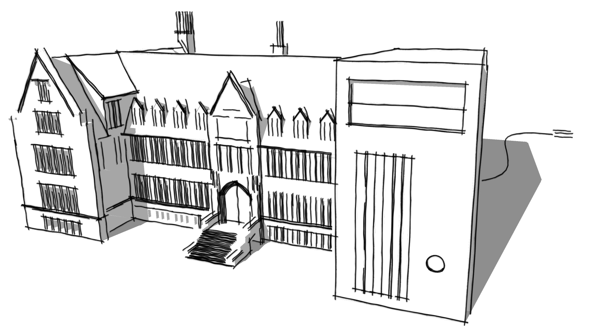
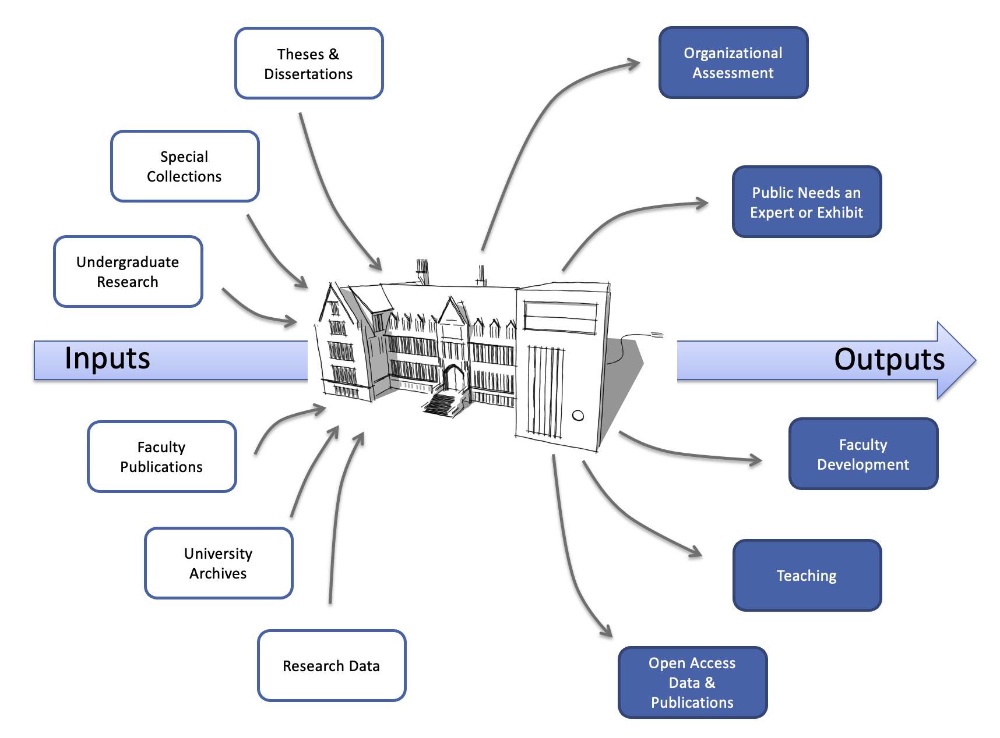
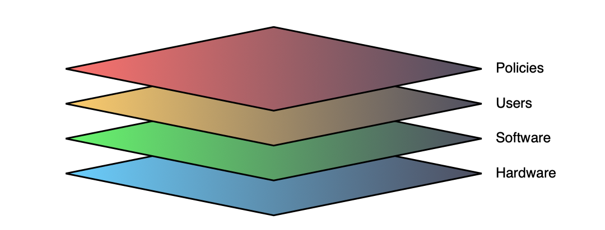
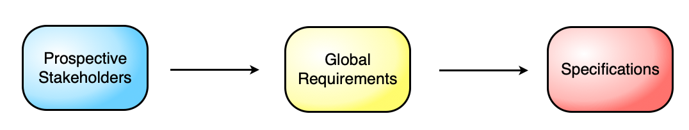

# ULIR: a proposal to establish an institutional repository for the University of Louisiana at Lafayette

## Overview

The modern research and teaching university must emphasize that it both creates knowledge that it disseminates directly through diverse channels and that it teaches others how to create knowledge. An institutional repository is foundational in any effort to highlight the university’s centrality in knowledge creation. The institutional repository is where we collect the raw materials that drive research, publish analysis and results, and open the institutional doors to higher education’s many publics.

In the last year, a variety of developments have greatly increased the interest in establishing frameworks for securing data and making it available in a highly configurable fashion. As various units became aware that there was a common interest, it became clear that the best way forward was to arrive at a common set of requirements that would lead to a widely-available resource that would suit the greatest number of users.

## Dimensions

An institutional repository has the potential to serve as a tangible indicator of a university's quality and to demonstrate the scientific, societal, and economic relevance of its research activities, thus increasing the institution’s visibility, status, and public value. The University of Louisiana at Lafayette is a highly competitive school within the Carnegie classification with a designation as Research University with high research activity. As a university we must communicate our institution’s competitiveness in relation to our peer institutions.

Through an institutional repository, the university can provide metrics with demonstrable evidence of cutting edge research and scholarship produced by faculty and students. The visible showcase provided by an institutional repository will highlight the achievements of our individual researchers and our institutional research centers. 

Currently, the University of Louisiana at Lafayette’s institutional output is diffused through thousands of scholarly journals. An institutional repository will collect the intellectual products created by researchers, faculty and students and provide a clear demonstration of our intellectual productivity. 

In addition to these myriad benefits, faculty-led student projects and papers can be given heightened visibility in the repository highlighting for potential students, and their families, the caliber and kind of work produced by students at the university. The public and permanent nature of the institutional repository can drive student scholarship as progressive projects come into the spotlight on the repository. The effect is both democratic and far-reaching: we are the place where knowledge gets made and shared.

## The Nature of a Digital Repository

Before proceeding any further, it might be wise, given the many and various audiences for such a document as this, to sketch out the various layers to a repository stack, to use a term from the technology sector. The classic example of a stack is the venerable LAMP stack that is considered the backbone of the modern, dynamic web.

To be clear, a digital repository is a particular kind of an institutional repository. While its digital nature makes easy a number of things that used to be far more expensive or difficult, it is still, like any organizational infrastructure, an intricate mixture of people, processes, and policies. It might be helpful to visualize the stacks thusly:

- The foundational stack for a digital repository is the hardware itself, typically a collection of servers and storage devices best determined and managed by IT professionals. 

- On top of the hardware rests a software stack, which can vary widely dependent upon the chosen option. The software stack can be simply a small collection of pieces, e.g., DSpace, or it could be a robust collection of things, such as the use by some organizations of Omeka as a front-end for DSpace, allowing organizations and users the ability to create highly-refined and easily navigable user interfaces, which can be defined as catalogs, collections, and/or exhibits, depending upon the desired functionality. 

- Interacting with the software stack in various ways and for varied reasons, there are users, who occupy a variety of roles. Privileged users would be the curatorial staff responsible for maintaining certain dimensions of the software as well as standards for metadata and data ingestion. Such archivists would interact with two further categories of users: faculty, staff, and students depositing materials into the repository and those seeking to access the metadata and/or data. 

- Over-riding all these layers are policies we as a University put in place that govern not only who gets to put what into the repository as well as who gets to view what — e.g., just metadata or the data itself — but also what the usage and copyrights of the materials will be for the various users: depositors, browsers, and the repository itself.

## Work Plan

With all these things in mind, I embarked upon a series of interviews with various potential stakeholders in order to arrive at a global set of requirements that could then be presented to the University’s CIO, Gene Fields, so that he could determine a set of technical specifications (software and hardware). Those specifications could then be used to establish budgets for options upon which the University could decide.

The goal of such a methodology is to arrive at an infrastructure that will fulfill the needs, and the aspirations, of faculty, staff, and units across the entire University. If we are all using the same infrastructure, contributing to it and drawing from it, we will have the greatest opportunity not only to maximize current workflows but to realize new ones. (See, for example, some of the scenarios in Appendix A.)

## Features & Functionalities

Whether in the sciences, in the humanities, or in the library, faculty were remarkably consistent in their hopes for, and in their concerns about, an institutional repository:

Some of these features deserve a bit of expansion. The world of publishing, both commercial and academic, is undergoing a transformation much like the shifting of tectonic plates, where new masses are emerging, often to the detriment of old masses. 

Nowhere can this be seen more easily than in the assumption, already being born out, that university libraries will become the publishing platform of choice for researchers in the future and that, concomitantly, that the new cyberinfrastructures make it possible to publish more kinds of things than were previously imagined (e.g., authentic, original texts; data sets; images; audio; video; etc.). But if libraries are the new platform, how then do we make documents “public” beyond the library’s doors or the library’s website? 

Clearly search is going to play a key role, and so one of the things we must consider in choosing the platform for our University’s repository is one that can participate with other repositories from Schools with whom we wish to be associated as well as those with whom we are currently peered. This will necessarily tend to lean us toward the community source options that have become the preference of schools like the University of Alabama, the University of North Carolina at Chapel Hill, Indiana University, the University of Wisconsin at Madison, UC-Berkeley, and the University of Chicago to name but a few of the schools that are involved in the Project Bamboo Consortium. Within our own group of peer institutions, the Georgia Institute of Technology and the College of William and Mary are using DSpace, while UNO, the University of Maryland at Baltimore County, and Texas at El Paso are using Digital Commons.  The UNCs outside of Chapel Hill are using an in-house system, and others appear to have no digital repository infrastructure at all. This represents an enormous opportunity for the University.

## Specifications

### Location(s)

As the peopled front-end, the Dupré Library is the logical location on the University of Louisiana at Lafayette campus to implement and maintain an institutional repository for the research of students and faculty. The Dupré Library is the main distributor of information and the librarians are trained in information collection, organization and dissemination. The repository will highlight the many areas of expertise at the University of Louisiana at Lafayette. All colleges, departments and research centers will have the opportunity to contribute to the repository to showcase scholarship. The Dupré Library is also an easy place for external constituents to find.

## Conclusions

The institutional repository at the University of Louisiana at Lafayette is consistent with the university wide strategies to achieve goals of becoming a national influence, to increase awareness of the current scholarship and to increase the academic reputation. The visibility of the intellectual output of the faculty and students will elevate the status of the university and will showcase the works and credentials of scholarship at the University of Louisiana at Lafayette. The institutional repository creates a visible resource for potential donors, alumni, the public and political decision makers to view academic scholarship in order to build support for the university. 

## Appendix A

Discussion of establishing a digital repository for the University of Louisiana began at least four years ago, though it mostly occurred within subsets of the University. Two years ago the Dean of the Library, Charles Triche, and the University’s Digital Humanities Liaison, John Laudun, began an interchange that widened in the following years to include not only the University’s Archivist, Bruce Turner, but also the Director of Distance Learning, Luke Dowden. The following usage scenarios and the accompanying diagram were part of the original February 2010 discussion between Laudun and Triche.

### Someone Needs an Expert
- Before: UL staff consult a static list only partially completed by some faculty once a year.
- After: UL staff search a repository which is constantly being updated and kept fresh by faculty members who are using it for a variety of functions. Expertise can be narrowed and potential collaborations can be generated. That is, staff can create knowledge.

### Organizational Assessment
- Before: Once a year faculty fill out workload forms; there is no way to generate “the big picture” without plodding through reams of paper.
- After: Administrators can instantly glimpse what faculty, as individuals or as a group, are doing. Workloads can be immediately discerned by combining data from the ULIR and ISIS. Faculty do not spend time compiling reports because the data is captured every time they enter a new record in the repository.

### Special Collections
- Before: Archives and Centers digitize materials on their own and either build their own infrastructure or participate in an infrastructure over which the university has no control and no opportunity to brand.
- After: Archives and Centers work with ULIR staff to deposit materials. Units are free to develop their own user interfaces for special needs or collections by using open source software like Omeka.

### A Timely Opportunity Arises
- Before: Journalists and others contact faculty and staff directly, many of whom do not necessarily know what others are doing.
0 After: Communications staff work with university administrators to assess the university’s potential responses and then gather a team of faculty and staff experts who can then be delivered to the community as a complete package.

### New Forms of Publications
- Before: Faculty and staff work independently and often with third-parties to develop a communication platform or publication over which they have less than the desirable amount of control over the final product.
- After: Faculty and staff work with ULIR staff to develop new forms of data collection, which themselves become another form of publication, and new forms of communications which remain within the scope of the university’s activities and thus maintains the university’s essential role in knowledge creation and distribution.

### Researcher Needs Data Storage
- Before: Faculty and students store valuable research data on  individual drives that are subject to loss or corruption.
- After: UL researchers work with ULIR staff to establish protocols for data collections/sets to be uploaded directly into the repository. Rights and usage by others are built into the system, allowing researchers to share their data with others, an additional form of publication emerging in the digital era. Just as importantly, the repository becomes the safe place for researchers to house their data, securing its future and their own.

### Finding New Publishing Possibilities
- Before: Faculty experiment with and deploy media individually, often working with third parties that claim the output.
- After: Faculty work with appropriate staff — Faculty Development, Audio-Visual, Digital Humanities Lab — to develop materials that are curated through the repository and then made a part of a selective portfolio published through establish channels, e.g. iTunes University.

### One Faculty Case
- Collection and storage of raw research, e.g. audio, images, video, research notes.
- Publication of green/gold materials, e.g. pre- or post-print materials as well as draft materials not yet otherwise available.
- Hosting of interim results and other media products, e.g. podcasts and videos. 

## Notes 

The LAMP stack is a terrific example of separate pieces of software that have slowly “grown together” over years because not only of their open source nature, making it possible for organizations and users to tweak things to their own purposes, which have made the overall stack so robust that it now is responsible, according to some estimates. for the lion’s share of delivery of content on the web. The letters in LAMP stand for Linux, the operating system; Apache, the web server software; MySQL, the database software; and PHP, the scripting language that queries the database based on user input, which could simply be a click of the mouse on a web page, and then creates the web page on the fly for that particular user.

Bamboo is a Mellon-funded initiative ($3 million over the past four years alone) that is focused on developing a framework of services and APIs that will allow participating organizations cyberinfrastructures to “talk” to each other — a kind of federated search. Accessibility means more than simply being able to “see” or “find” something, as anyone who has searched for an article, it also means being able to use it. To be fully functioning, systems need to be interoperable. Just as importantly, by using a common system, workflow problems and bugs become common as well, allowing us to take advantage of others’ repairs and innovations. This kind of leapfrogging is not an option within a vendor-determined system.
