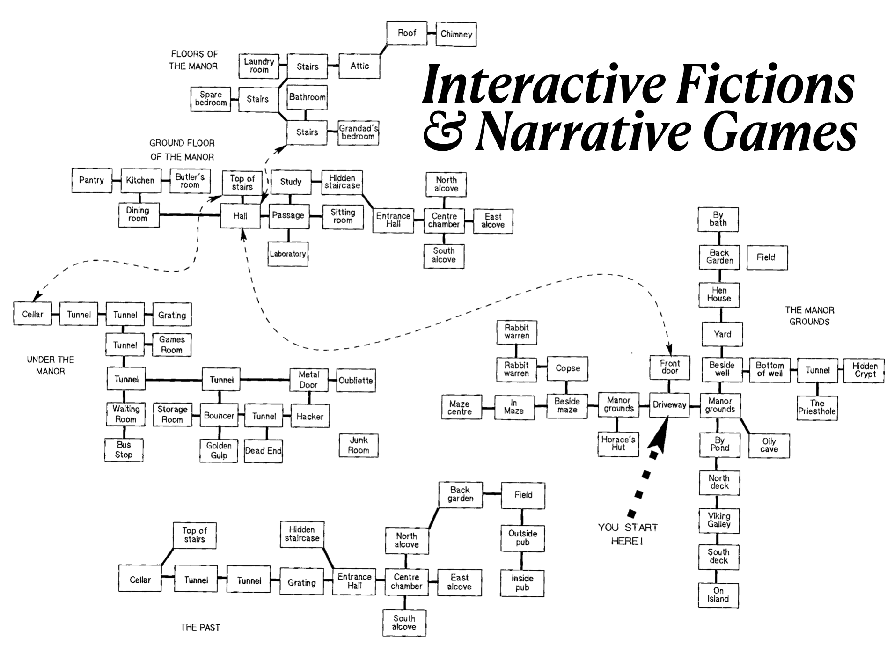

# Interactive Fictions & Narrative Games
ENGL 370-002 / TuTh 12:30-13:45 / HLG 320

Pr. John Laudun / HLG 356 / laudun@louisiana.edu

## Description

Branching narratives, interactive fiction, text adventures, CYOA (Choose Your Own Adventure) all describe a form of entertainment—be it literary, performed in a group, or in a video game—in which a reader is given choices and their choices determine the nature and outcome of the story. This course explores the history of narrative games, from collaborative storytelling in oral cultures to the robust open-world games to cinematic universes in which multiple storylines exist (and sometimes interact). Course inputs include reading, viewing, and playing. Course outputs include analytical explorations of forms and mechanisms and the development of fictions of your own.

## Objectives

This course aims to provide participants with the necessary tools and skills to analyze and, at least begin, to create narrative games. To do this, participants will need to master: foundational concepts in narrative studies and game studies, experiment with a variety of game mechanics, engage others collaboratively (and occasionally competitively), document their work both individually and collectively, and be able to present their work to an audience.

## Materials

The list of materials, both physical and software, is long. Much of our reading will be in pieces either already available online and/or for download or provided via the Teams instance. 

### Hardware

* Participants will need a set of die that includes several D6 and at least one each of D8, D12, and D20 (more is better but not required). 16mm and 19mm dies are more adult human friendly, but functionality matters more than size.
* Participants will also need a steady supply of 3 x 5 cards.
* We will be prototyping, and trialing, both physical and virtual narrative game forms. Participants need to be able to generate both. While there are pre-cut square and hexagonal game tiles of various sizes, blank playing cards, and a myriad other ready-made materials, access, and willingness to use one's imagination, cardstock and cardboard are the only things required. (An awful lot can be achieved with 3 x 5 cards.) *And, yes, effective, and compelling, game figures can be created out of cardboard cutouts and markers.* 
* In order to create the cards, tiles, and boards from a variety of materials, participants will also need to have scissors or other cutting implements -- please exercise caution and remember to use a cutting mat when working -- as well as markers or painting supplies.

### Software

* In addition to these physical materials, participants will of course need to access to a computer and software. The university provides a license to Office 365. Use of Teams is mandatory, and you might as well use the other apps as well. There is a fair amount of writing in this course, much of it structured, and so familiarity with the outline view and the relationship between outline headings and styles is highly recommended. PowerPoint can be an interesting platform for interactive fiction with its ability to have clickable links between non-sequential slides.
* We will be using network graphs to represent interactive fictions and narrative games. You can create simple diagrams in presentation software like PowerPoint or Keynote, but anything more than a few nodes high/deep quickly becomes about managing readability and not about being generating ideas. There are a variety of mind-mapping, as well as diagramming, applications available. Please familiarize yourself with one: you will be making network visualizations both for analysis as well as creativity.
* In some cases, the paths available to a reader are actually places within a storyworld -- rooms in a house or buildings in a town -- and authors of those fictions/games may find diagramming software useful. (We will still use networks to visualize reader/player paths through a game/fiction.)
* For those interested in text-based storytelling, there are multiple open source applications available for writing and compiling playable stories/games. (See **Resources** below for descriptions and links.)

## Grading

More than anything, this course expects and requires that participants be open to new ideas and different kinds of course experiences. This is the first time this course has been offered at UL, and so much of the content, in terms of both readings, lectures, and discussions as well as assignments is exploratory in nature: what do participants need to know to think more clearly about stories and games and the media within which the two combine? 

**Participation** (40%) includes all group activities as well as contribution to in- and out-of-class discussions.

**Assignments** (30%) include all the small assignments that will be completed throughout the semester and which should also be collected in a portfolio at the end of the semester. (The assignment portfolio is part of this grade.)

**Project** (30%): participants can choose to work individually or collectively on their *magnum opus* for the course, a narrative game / interactive fiction of a form and in a medium of their choosing. Prior approval of the instructor is required: this course is about ideation, planning, and execution at a high level thanks to drafting and revision; it is not about surprises and last-minute deadline screeching.

## Resources 

* Incompetech has a grid generator as well as pre-formatted grid PDFs you can print: [Grid Paper PDFs](https://incompetech.com/graphpaper/). (Feel free to search for “grid generator” to see what else is out there.) Grids are great for maps of all kinds as well as for planning.

### Interactive Fiction

[Teaching and Learning With Interactive Fiction](https://bdesilets.com/if/) has a lot of resources, including links to famous interactive fictions. (You can download the entire site as a PDF.) There is also the [The Interactive Fiction DatabaseAdventures](https://ifdb.org/) which list interactive fiction and text adventures.

For those interested in writing, interactive fiction there are a lot options in terms of applications that are available. The three below are both free to use and open source. They also have active development and user communities, which means help, advice, and encouragement are never far away. The apps are listed in order of ease-of-use for a beginner. Both Twine and Inky use a plain text markup language which can actually be written in any text editor: Microsoft Visual Studio Code extensions are available for both *twee* and *ink*.

* [Twine](http://twinery.org) is another piece of open source software for creating interactive fiction / non-linear stories. Twine is based on a markup language that you can write in any text editor -- I use , *twee*, as well as *ink* (below). You can also download the free Twine editor which has a GUI that allows you create the kinds of visualizations discussed above.
* [Ink](https://www.inklestudios.com/ink/) is a easy-to-understand markup language that has Unity and Unreal compatibility. (See the website for about plugins and compatibility.)
* [Inform](https://ganelson.github.io/inform-website/) is open source software  for creating interactive fiction. It uses something very close to natural language syntax and makes it easy to draft and then compile a playable text-based game. The website has links not only to the download but also to a variety of useful resources on interactive fiction: writing advice, community forums, and example fictions.

It is too late to enter this year's [Interactive Fiction Competition](https://ifcomp.org/), but there's always next year. In the mean time, this year's entries will be released to the public on September 1.

### Game Design

* [The Level Design Book](https://book.leveldesignbook.com/)

## Schedule

### Foundations

Due to a prior schedule commitment, I will not be available to meet August 29- September 5. On our first day of class we will need to cover the usual course overview and then set up groups and proceed with the first group assignment.

### Game Theory

* Martin Osborne’s [Introduction to Game Theory](https://www.economics.utoronto.ca/osborne/igt/) is an online book.
* Open Textbook Library has Nordstrom and Oregon[Introduction to Game Theory: A Discovery Approach](https://open.umn.edu/opentextbooks/textbooks/802) available both online and as a downloadable PDF.
* Coursera has Stanford’s[Game Theory](https://www.coursera.org/learn/game-theory-1) class. The claim you can finish it in 17 hours.

Go to https://ncase.me/trust/. Play the game. Write down two things: (1) Implications of the game theory behind “The Prisoner’s Dilemma” for game design and (2) the implications for life.

Sooner or later…

Assignment. Your first creative assignment is to write a simple branching narrative with a walk of at least four nodes. There must be at least two branches. (For those keeping track: this means at least three outcomes, but you can write the story such that paths merge past a branch.)