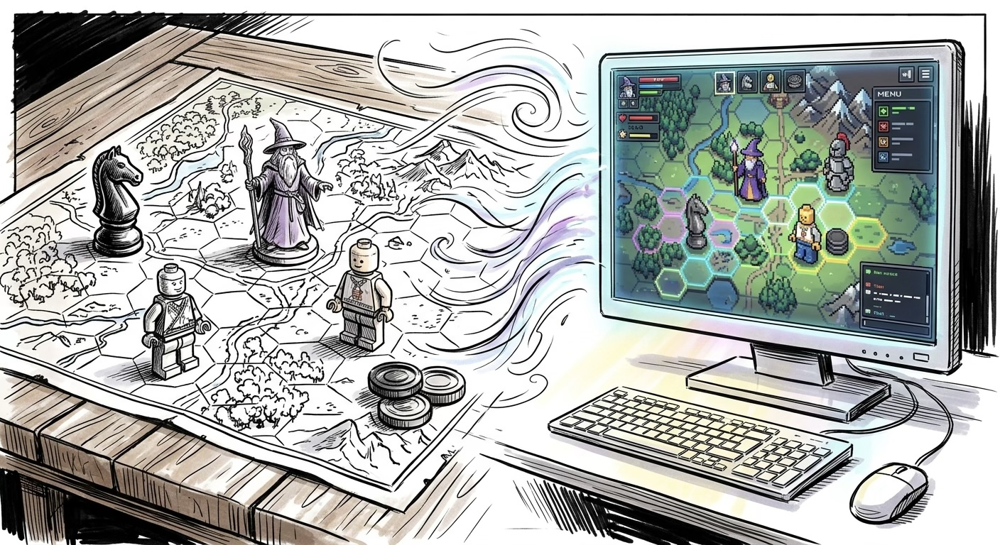
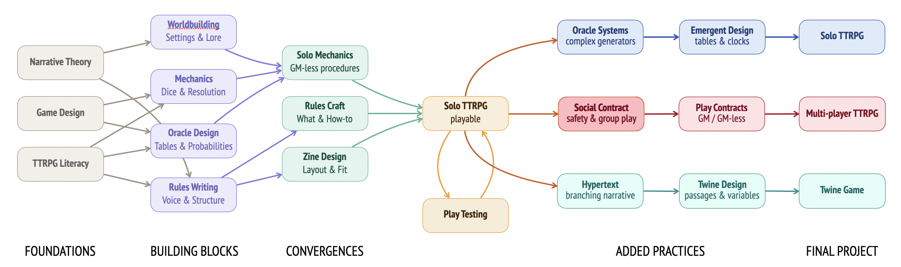

# Story Games
ENGL 370-002 / TuTh 12:30-13:45 / HLG 320  
Pr. John Laudun / HLG 356 / laudun@louisiana.edu

## Description

Branching narratives, interactive fiction, text adventures, CYOA (Choose Your Own Adventure) all describe a form of entertainment--be it literary, performed in a group, or in a video game--in which a user is given choices and their choices determine the nature and outcome of the story. This course considers the history of narrative games, from collaborative storytelling in oral cultures to the robust open-world games to cinematic universes in which multiple storylines exist (and sometimes interact). 

Course inputs include reading analytical--game studies!--and practical essays as well as viewing analytical and practical videos--(warning: these can be long), and of course playing games of various kinds. 

Course outputs include several short analytical essays as well as the development of a solo TTRPG by mid-semester which can be revised or expanded into a multi-player TTRPG or turned into a sketch for a video game as a final project. 

## Objectives

This course aims to provide participants with the necessary tools and skills to analyze and to create story/narrative games. To do this, participants will need to master: foundational concepts in narrative and game design, experiment with a variety of game mechanics, engage others collaboratively (and occasionally competitively), document their work both individually and collectively, and be able to present their work to an audience. 

We start with TTRPGs because they require clear and effective writing. For those more interested in video games, TTRPGs are a good place place to experiment with game mechanics. (See this [2023 GDC talk](https://www.youtube.com/watch?v=6sXdCKd0XdE).) Everyone builds a solo TTRPG. Everyone.

## Course Materials

### Textbook

For this iteration of the course, we will be using Skaff et al's *Characteristics of Games*. For those interested in video games, Heussner et al's *The Game Narrative Toolbox* offers a lot of practical advice and has previously been the textbook for this course. The short of it is this: this is an upper-division course: you will be reading. Buy the book; read the material. Come ready to discuss--as well as to operationalize!

Elias, George Skaff, Richard Garfield, and K. Robert Gutschera. 2012. *Characteristics of Games*. MIT Press.

Heussner, Tobias, Toiya Kristen Finley, Jennifer Brandes Hepler, and Ann Lemay. 2023. *The Game Narrative Toolbox*. Focal Press Game Design Workshops.

In addition to the textbook, there are a variety of readings  online, including via portals like JSTOR, or under the files tab in our Teams instance.

Finally, make sure you check out the [Resources](./resources.md) page. There is a lot of useful links there. (And more links are welcome!)

### Hardware

In addition to the textbook, there is also a list of materials: 

* **Dice**: Participants will need a set of die that includes several D6 and at least one each of D8, D12, and D20 (more is better but not required). 16mm and 19mm dies are more adult human friendly, but functionality matters more than size.
* **3 x 5 cards**: We will be prototyping, and trialing, first physical and, perhaps later, virtual narrative game forms. Participants need to be able to generate both. While there are pre-cut square and hexagonal game tiles of various sizes, blank playing cards, and a myriad other ready-made materials, access, and willingness to use one's imagination, cardstock and cardboard are the only things required. (An awful lot can be achieved with 3 x 5 cards.) *And, yes, effective, and compelling, game figures can be created out of cardboard cutouts and markers.* 
* **Markers & Scissors**: In order to create the cards, tiles, and boards from a variety of materials, participants will also need to have scissors or other cutting implements -- please exercise caution and remember to use a cutting mat when working -- as well as markers or painting supplies.

### Software

* We will be using network graphs to represent interactive fictions and narrative games. This can be done entirely with note cards, by the way, but you can also create simple diagrams in presentation software like PowerPoint or Keynote. Anything more than a few nodes high/deep quickly becomes about managing readability and not about generating ideas. There are a variety of mind-mapping, as well as diagramming, applications available. Feel free to familiarize yourself with one but you can do an awful lot with [Twine](https://twinery.org). See Resources > Software for more.
* In addition to these physical materials, participants will of course need access to a computer and software. The university provides a license to Office 365. Use of Teams is mandatory, and you might as well use the other apps as well. There is a fair amount of writing in this course, much of it structured, and so familiarity with Word's outline capabilities and the relationship between outline headings and styles is *strongly* recommended. (We will discuss this in class, but you should start familiarizing yourself with this stuff now: your life will be so much easier for it.) PowerPoint can be an interesting platform for interactive fiction with its ability to have clickable links between non-sequential slides, and Excel can be pressed into service as a kind of database or project outline and/or Gantt chart. (If you use the equivalent software elsewhere, familiarize yourself with export options to Office file formats -- I prefer Keynote to PowerPoint, but there is no Keynote option on the classroom computer.)

## Assignments & Grading

It should be noted upfront that the essential sequence of this course is the design and manufacture of a solo TTRPG for the mid-semester project, with the chance to refine it, expand it to a multi-player TTRPG, or convert it to a pseudo-video RPG (using Twine) as the final project.

More than anything, this course expects and requires that participants be open to new ideas and different kinds of course experiences. This course was first offered in 2024, and it remains exploratory in many ways, always seeking to answer the question: what do participants need to know to think more clearly about stories and games and the media within which the two combine?

**Participation** (20%) includes all group activities as well as contribution to in- and out-of-class discussions.

**Assignments** (20%). There are a number of small assignments in this course: in-class activities, quickfire writing, analytical essays, design journals. (This is an English class, of course there is writing. Of course!) Some of the assignments are about developing your overall knowledge of games and narrative, and some are focused on you developing your own game(s). In all cases, this course is about ideation, planning, and execution at a high level thanks to drafting and revision; it is not about surprises and last-minute deadline screeching. *You have been warned.*

**Midterm (Solo) TTRPG** (30%). Table-Top Role-Playing Games are a great way to “see” the mechanics that underlie computer games and other automated systems. In addition to the rules set which is an outcome of the process, you are expected to keep a project logbook where you document the process itself—if you aren’t having a conversation with yourself, what are you doing? While the rules set will be shared with all participants, the process document, the logbook, is only for your eyes and those of the instructor. 

**Final RPG** (30%): Video games are what most people think about if they don’t think about *Dungeons and Dragons* first. As our textbook makes clear, most video RPGs are created by teams for a reason: there’s a lot to the end product. Here, we are prototyping a game, using Twine as the basis: there is a surprising amount of functionality under its hood and it keeps you focused on the essentials of good narrative game design: the critical path and the choices you present the player.

This course has no exams: it is focused on individual and group productivity. If you need an exam to motivate you to learn or to work, this course is not for you. 

## The Small Print

There is a common set of guidelines/requirements on how to be a participant in a course I facilitate. Read [The Essentials](https://johnlaudun.net/teaching/guides/essentials.html). That note is part of a collections of notes I have compiled over the years in response to common questions and needs. Please consult those [guides](https://johnlaudun.net/teaching/guides/) to see if your question already has an answer. (In all cases, my answer there will be better.) 

And, sigh, yes, there is an AI policy for this course, and it is quite simple: if you feel the need to use AI to produce user-facing materials for this course, then this course is not for you. This class assumes that the participants are committed to their own growth in understanding and practice. Period. If you would like to use an AI to help you think through probabilities and mechanics, you may do so, but you must make that clear in your project notes.

## Agenda

Please note that this course follows an agenda, not a schedule. The actual timing of discussions will be determined by the interest, experience, and expertise in the room. Some topics will expand; others will contract. If you are unsure about the date for a particular reading or discussion or assignment, first check *Teams* to see if an update has been posted and then check with a classmate.

Like any good resource management game, this course has an underlying skill tree which is overly ambitious. The agenda follows the skill tree, more or less.

There are a lot of links below. The goal is to give you a wide spectrum of materials in hopes that you will find those that speak to you and move your thinking, and your writing/crafting, forward. To be sure, there are a lot of websites and writers out there, all with good insights. This particular sample is representative but not comprehensive: please feel free to add! 

### Foundations

#### Narrative Theory

*  From *The RPG Gazette*: [Randomization vs. Narrative Control: Different Approaches to Storytelling in TTRPGs](https://therpggazette.wordpress.com/2025/02/05/randomization-vs-narrative-control-different-approaches-to-storytelling-in-ttrpgs/). 

#### Game Design

* [Game Developer](https://www.gamedeveloper.com/) has an [excerpt]((https://www.gamedeveloper.com/design/game-design---theory-and-practice-the-elements-of-gameplay)) from Richard Rouse’s *Game Design: Theory & Practice*. It’s from 2001, but the essentials are all there.

- Skeleton Code Machine lists its own greatest hits: [Start here: The best of](https://www.skeletoncodemachine.com/p/start-here).

#### TTRPG Literacy

* [Why Handmade RPG Materials Make Your Solo TTRPG Games 200% Better](https://codexgigaspress.substack.com/p/why-handmade-rpg-materials-make-your)

### Building Blocks

#### Worldbuilding

* Copy/Paste Co-Op’s [How to write an OSR adventure](https://substack.com/inbox/post/204924505). 

#### Mechanics

First things first, quite literally. [Brenda Romero](http://brenda.games) has argued that “the mechanics is the message.” While there is not an expectation that your game will attempt to address a matter of great concern, like income inequality or the capacity of ordinary people to do bad things, there is no such thing as any human-made thing not containing a point of view. It’s even better when that perspective has a particular focus. Define yours and then deliver. 

Travel Mechanics: Hex Crawl, Point Crawl, [Tile Crawl](https://www.youtube.com/watch?v=PriQjApAXW0). 

#### Oracle Design

#### Rules Writing

### Convergences

* JP Coovert has a series of videos on zine production. [How To Print Your Own Zines From Home!](https://www.youtube.com/watch?v=rHucIjaRZZ0) is a good place to start.

### Getting Started with TTRPGs

There are plenty of places to get interesting insights into game design. A short list might include the following, but please be aware that there are a number of channels on Youtube and Discord as well as Substack sites. 

- Tabletop Skirmish Games: [Make Your Own Tabletop RPG](https://www.youtube.com/watch?v=wRwkfWaTy_U). 
- How to Be a Great GM: [7 Things You Should Know When Making Your Own TTRPG](https://www.youtube.com/watch?v=v8K3lQCXcAk&t=19s). 
- Extra Credits: [How To Start Your Game Narrative: Design Mechanics First](https://www.youtube.com/watch?v=22HoViH4vOU).

**Analysis**. You are free to choose any TTRPG for your analysis your analytical essay, but I do recommend considering a smaller TTRPG (one whose rule set is less than 100 pages). 

**Build**. The rule set for your TTRPG must be at least 1000 words. It must contain clear directions. It is recommended that you do not require players to have too many particular materials, though it is not unreasonable to require figures. (If you have particular figures in mind and can point people to their 3D print files, then all the better.) Focus on games playable in small spaces (no more than 24 x 24 inches). 

If you don’t quite know where to get started with rules, you can always use/adapt one of the open source systems, both of which have Discord communities:

- [Shift](https://hitpointpress.itch.io/shift-rpg-core-rulebook) is a bit expensive, but the core rule set is extensive (160+ pages!).
- [2400](https://jasontocci.itch.io/24xx) (also 24XX) is free or very inexpensive and offers a variety of adjacent materials.
