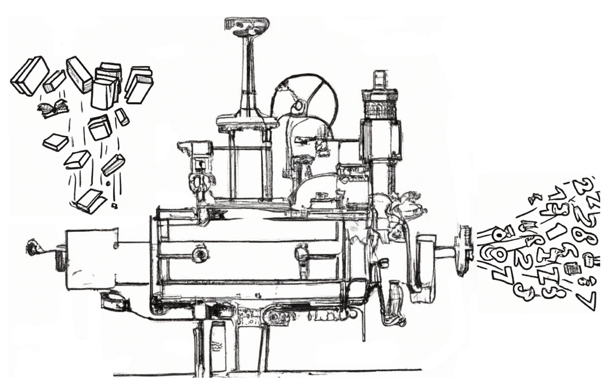

# Word Machines

Pr. John Laudun / HLG 356 / laudun@louisiana.edu

ENGL 370 TR 11:00--12:15 (Oliver 202)

## Description

The analysis of texts can be a daunting prospect, whether it is millions
of small texts posted as messages or thousands of large texts made up of
thousands of words. Texts are messy, the product of humans who have more
than one way to apprehend the world --- and usually apprehend it quite
differently --- who are, in fact, negotiating reality via texts. However
messy they appear, texts produce results predictably and are more
structured than they might appear. While some may shudder at the memory
of vocabulary quizzes, sentence diagrams, and lectures on lyric poetry
or the sonnet, the fact is that almost all texts regularly and reliably
string words together using sequencing patterns that causes them to be
received in a particular way. Maybe we can just imagine them as machines
made of words?

## Objectives

Of the many dimensions that computation can address, perhaps one of the
most difficult is the task of dealing with how humans actually use
language. While a great deal can be gleaned from a variety of bounded
events and actions---for example, by limiting the possible responses to
a question, much more can be learned when we allow humans to produce the
texts they wish to produce and then we as analysts set about finding
better ways to understand them. This course is an introduction to text
analytics, aka text mining, with particular emphases on texts and
analytical outcomes. It is designed to familiarize students with the
many dimensions of addressing *text as data*, from text processing to
vector semantics to recent developments in AI. The objectives are
straightforward: understand the basics of natural language processing,
develop approaches to text processing with an especial focus on a corpus
developed by participants (either individually or collaboratively), and
to communicate those efforts effectively both in language and through
visualizations.

## Expectations

The course assumes that participants have a familiarity with the
fundamental features of Python, the programming language we will be
using to examine natural language. To be clear, most of our examples
will be drawn from English, but some of our discussion will be focused
on what it means to work across languages. We will also give some
consideration to how a focus on English has shaped the development of
NLP, which in turn has shaped what the functionality of many NLP
operations available in Python and other programming languages.

The course sequence begins with a quick review of Python and basic text
processing operations. From there we spend time with regular
expressions, parsers, and state machines. After that, we take up the
necessity of collecting data and then working with our data set to
answer questions that arise from the data itself.

As participants work through the course, they are expected to:

1. understand the basics of text processing in Python,
2. build upon those basics to develop approaches to text processing,
3. apply those approaches to a set of texts (a corpus),   
4. develop a corpus of their own and articulate the better approaches to that corpus,
5. use the methods we have explored to map that corpus and to derive interesting insights, and
6. communicate those insights in research notebooks that are richly reported with code that is clearly commented.

We will use a variety of data sets throughout the course, and it is
expected that those data sets, also known as corpora in some instances,
will act as models/examples for you to build your own.

Finally, it should be noted that this is not a course in programming,
and it is not taught be a computer or information scientist. In many
instances, participants will be better programmers than the instructor:
my role is to offer the insights of someone who has examined texts both
by hand and by algorithm for over 20 years and to facilitate your
engagement with the known issues and dimensions as well as those you
discover.

## Requirements

### Texts

Required reading in this class comes in two forms, the classical text
book listed below and a series of readings from published studies
approaching the question of text analytics from a variety of
perspectives, from the humanities to the human sciences to information
and computer science.

We will be using one of the following texts:

Karsdorp, Folgert, Mike Kestemont, and Allen Riddell. 2021. *Humanities
Data Analysis: Case Studies with Python*. Princeton University Press.

Bengfort, Banjamin, Rebecca Bilbro, and Tony Ojeda. 2018. _Applied Text
Analysis with Python: Enabling Language Aware Data Products with Machine
Learning_. O'Reilly Media.

Grimmer, Justin. 2022. _Text as Data: A New Framework for Machine
Learning and the Social Sciences_. Princeton University Press.

We will also be using the following book, which is also available for
free as a website–the URL is included with the information.

Bird, Steven, Ewan Klein, and Edward Loper. 2009. *Natural Language
Processing with Python*. O'Reilly Media. <https://www.nltk.org/book/>.

Jacob Perkins, author of *Python 3 Text Processing with NLTK 3 Cookbook*, has demos on stemming and lemmatization, sentiment analysis, tagging and chunk extraction, and phrase extraction and named entity recognition. [URL](http://text-processing.com).

Please note: we read broadly from corpus linguistics, corpus stylistics,
information and data science. Successful participation requires that you
keep up with the reading.

### Setup

This course requires the use of **Python** and that participants are able to install libraries and other resources as needed. Much of this package management will be handled by **mini conda**, a package manager accessed through the CLI, so it is expected that participants are comfortable with their operating system's terminal or command shell interface. (More advanced participants will perhaps want to edit their config files.) We will use Jupyter notebooks both for their ease of use but also for their ability to create complete documentation solutions: all assignments will be Jupyter notebooks. Code for the class is maintained on a **GitHub** repo, and participants will commit their own code to a course repo designed to make it easy for everyone to see each other's work and to share data.

### Assignments

More than anything, this is a course where participants *do* things:
from start to finish, the course is a series of activities designed to
give you a sense of how to think about texts when you are doing *your*
*work*. While we begin with some toy corpora to expose you to ideas and
issues associated with text analytics, the goal of the course is to have
you develop a corpus of your own, either individually or
collaboratively, to perform some analysis, and to report your findings
in a clear and cogent fashion. (See section on criteria below for details on how assignments are graded.)

**Quizzes & Participation**. At various times during the semester participants are asked to write on topics that have been covered in the preceding weeks. The writing is sometimes on paper (usually individually) and sometimes it is on the whiteboard either with a group or to a group. The focus is not on neither correctness nor exactness but simply on talking your way through a problem. The assignments may include pseudo-code (and/or code) as well as comments that explain not only the code but the concepts and methods at stake. E.g., if a step in the overall workflow removes stopwords, participants are expected to explain how and why this is occurring.

**Notebooks**. This course is really designed to produce a final project of various parts/phases. The plural in the assignment title reflects the multi-stage process in which sub-assemblies are put together in a sequence and feedback is provided, by both the instructor as well as other participants. The final version of the project, which may very well not be finished, gathers all the pieces into an assembly and the producer(s) of the project provide an explanation not only of the pieces and the assembly but also their response to feedback. Possible notebooks include:

- Single Text Operations
- Corpus Creation
- Corpus Operations
- Sentiment and PoS Tagging
- Word2Vec
- Network / Transformer
- CYOA (Choose Your Own Adventure) Notebook

#### Evaluation Criteria (same for all projects)

**Code/Approach** (50%): Does the code produce useful results? Is it properly documented with #comments and doc strings? Does it use appropriate data structures?

**Write Up** (50%): Is it clear what was done and why? Does it adequately cite resources used? Does it adequately cite sources, references, and code adapted? Does it include some evaluation? Is there any analysis of errors? Does it point out any remaining issues? Is it formatted correctly?

Assessment problems are generally open ended -- it is not expected that the student can solve them fully: the goal is to see how they approach the problem and understand it.

| Dimension| Expected | Acceptable | Unworkable | Value |
| -------- | -------- | ---------- | ---------- | ----- |
| **_Structure_**   | The notebook has a clear structure with headings and explanatory paragraphs followed by code blocks that do what the description says. The code blocks are followed by text blocks that discuss the results. | There are headings that indicate sections of work. Small blocks of text attempt some explanation. | There is no clear structure. One block tumbles after another. There is no way to scan the document.                                                | 30        |
| **_Text Blocks_** | The text blocks (cells) are used to explain a larger idea, to work through the implications for the code to come, and to work through pseudo-code as necessary. Follow-up text blocks note the results and discuss what changes need to be made. (This can be in the form of "When I first ran this with this code or these parameters, I got these results and I made these changes." | Text blocks explain working code but little more.                                                          | At worst, text blocks are not used. Almost as bad are poorly written text blocks which make no attempt to explain the analyst's thought processes. | 30        |
| **_Code Blocks_** | First and foremost the code is commented and it's clear what lines or blocks of code is doing. In the excellent category, even the imports are commented! The code itself is "Pythonic" and uses vertical spacing to increase readability.                                                                                                                                          | Comments are brief and do not cover all aspects of the work. The code works, but it is not easy to follow. | Code lacks comments and/or is jumbled.                                                                                                             | 40        |

## Schedule

The schedule for this course can be found in the course's dedicated [repository](https://github.com/johnlaudun/text-as-data) which also includes other course materials.

### 0. Introductions

In the first week we make all the usual introductions: course and participants (all of us in the room). We then begin the first of many considerations of what it means to quantify qualitative things like words from a very “big picture” point of view, if only to remind ourselves that for every insight, there is a blindness. The good news is that there are many questions to ask, and many ways to ask them. We finish with getting ready to begin our analytical journey. 

### 1. Python, Jupyter Notebooks, Git + GitHub

The code we use is, for the most part, fairly basic, running a lot on a minimal set of control structures like `for` loops and the occasional `if` statement. The more important thing we cover in this unit are data structures. (Real Python has a well-written tutorial on [data types](https://realpython.com/python-data-types/).) While Python comes with a limited set of data structures (strings, lists, dictionaries, tuples, etc.) a number of libraries we use extend those structures in very interesting ways: the NLTK library, for example, will return a tokenized sentence with parts of speech tags as a list of tuples with the word in the zero index and the PoS tag in the first index. Being able to get data out or iterate through a data structure is essential to doing text analytics. 

### 2. Single Text Operations

### 3. Creating and Working with a Corpus

### 4. Syntax and Semantics

Parts-of-Speech tagging and sentiment 

### 5. Sequences & Semantic Spaces

Word2vec

### 6. Deep Learning & AI

RNNs, GANs, BERT, GPT. 
