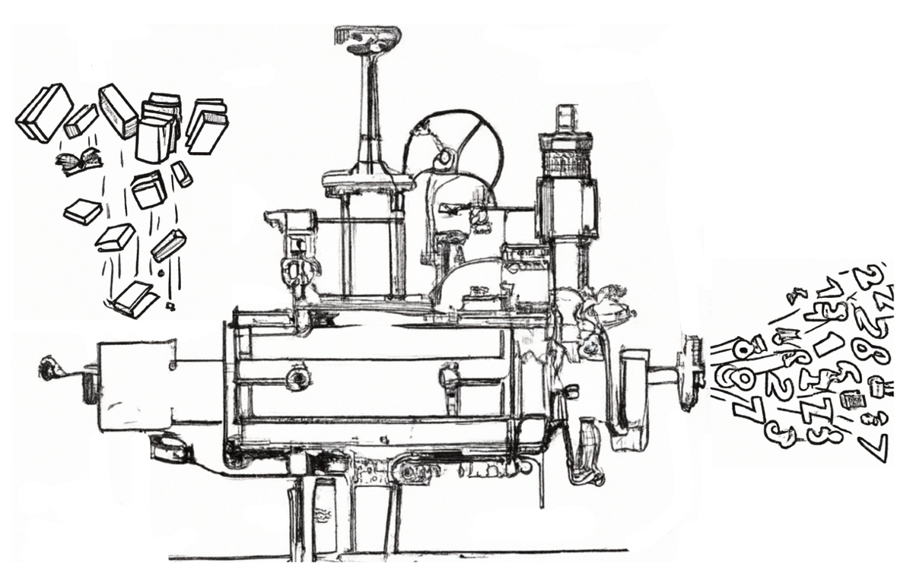

# Word Machines

Pr. John Laudun / HLG 356 / laudun@louisiana.edu

ENGL 370 TR 11:00--12:15 (Oliver 202)

## Description

The analysis of texts can be a daunting prospect, whether it is millions
of small texts posted as messages or thousands of large texts made up of
thousands of words. Texts are messy, the product of humans who have more
than one way to apprehend the world --- and usually apprehend it quite
differently --- who are, in fact, negotiating reality via texts. However
messy they appear, texts produce results predictably and are more
structured than they might appear. While some may shudder at the memory
of vocabulary quizzes, sentence diagrams, and lectures on lyric poetry
or the sonnet, the fact is that almost all texts regularly and reliably
string words together using a sequencing pattern that causes them to be
received in a particular way. Maybe we can just imagine them as machines
made of words?

## Objectives

Of the many dimensions that computation can address, perhaps one of the
most difficult is the task of dealing with how humans actually use
language. While a great deal can be gleaned from a variety of bounded
events and actions---for example, by limiting the possible responses to
a question, much more can be learned when we allow humans to produce the
texts they wish to produce and then we as analysts set about finding
better ways to understand them. This course is an introduction to text
analytics, aka text mining, with particular emphases on texts and
analytical outcomes. It is designed to familiarize students with the
many dimensions of addressing *text as data*, from text processing to
vector semantics to recent developments in AI. The objectives are
straightforward: understand the basics of natural language processing,
develop approaches to text processing with an especial focus on a corpus
developed by participants (either individually or collaboratively), and
to communicate those efforts effectively both in language and through
visualizations.

## Expectations

The course assumes that participants have a familiarity with the
fundamental features of Python, the programming language we will be
using to examine natural language. To be clear, most of our examples
will be drawn from English, but some of our discussion will be focused
on what it means to work across languages. We will also give some
consideration to how a focus on English has shaped the development of
NLP, which in turn has shaped what the functionality of many NLP
operations available in Python and other programming languages.

The course sequence begins with a quick review of Python and basic text
processing operations. From there we spend time with regular
expressions, parsers, and state machines. After that, we take up the
necessity of collecting data and then working with our data set to
answer questions that arise from the data itself.

As participants work through the course, they are expected to:

1.  understand the basics of text processing in Python

2.  build upon those basics to develop approaches to text processing

3.  apply those approaches to a set of texts (a corpus)

4.  develop a corpus of their own and articulate the better approaches
    to that corpus

We will use a variety of data sets throughout the course, and it is
expected that those data sets, also known as corpora in some instances,
will act as models/examples for you to build your own.

Finally, it should be noted that this is not a course in programming,
and it is not taught be a computer or information scientist. In many
instances, participants will be better programmers than the instructor:
my role is to offer the insights of someone who has examined texts both
by hand and by algorithm for over 20 years and to facilitate your
engagement with the known issues and dimensions as well as those you
discover.

## Requirements

### Texts

Required reading in this class comes in two forms, the classical text
book listed below and a series of readings from published studies
approaching the question of text analytics from a variety of
perspectives, from the humanities to the human sciences to information
and computer science.

We will be using one of the following texts:

Karsdorp, Folgert, Mike Kestemont, and Allen Riddell. 2021. *Humanities
Data Analysis: Case Studies with Python*. Princeton University Press.

Bengfort, Banjamin, Rebecca Bilbro, and Tony Ojeda. 2018. _Applied Text
Analysis with Python: Enabling Language Aware Data Products with Machine
Learning_. O'Reilly Media.

Grimmer, Justin. 2022. _Text as Data: A New Framework for Machine
Learning and the Social Sciences_. Princeton University Press.

We will also be using the following book, which is also available for
free as a website–the URL is included with the information.

Bird, Steven, Ewan Klein, and Edward Loper. 2009. *Natural Language
Processing with Python*. O'Reilly Media. <https://www.nltk.org/book/>.

Please note: we read broadly from corpus linguistics, corpus stylistics,
information and data science. Successful participation requires that you
keep up with the reading.

### Assignments

More than anything, this is a course where participants *do* things:
from start to finish, the course is a series of activities designed to
give you a sense of how to think about texts when you are doing *your*
*work*. While we begin with some toy corpora to expose you to ideas and
issues associated with text analytics, the goal of the course is to have
you develop a corpus of your own, either individually or
collaboratively, to perform some analysis, and to report your findings
in a clear and cogent fashion.

## Schedule

### Unit 0 \| getting started

*In the first two weeks of the course, we lay out some of the basics of
what we will be doing: quantifying qualitative data. For every insight,
there is a blindness. There are many questions to ask, and many ways to
ask them.*

#### 0.1 What is a text?

Our course introduction is the 8000-word short story "The Most Dangerous
Game." We spend the first week approaching the text from a number of
computational angles, many of which we calculate by hand.

**Method(s)**: term frequencies (TF), summarization/indexicality

**Action(s)**: In groups, create a meaningful visualization of "The Most
Dangerous Game" based on a quantification of your choosing.

**Consideration(s)**: [["The Zipf
Mystery"]{.underline}](https://www.youtube.com/watch?v=fCn8zs912OE).

#### 0.2 Python Text Processing Basics

In the second week we establish the basics of loading text from files,
identifying and extracting core content, and deconstructing texts into
various constituent parts: paragraphs, sentences, words. We also discuss
what it means to work with a corpus and how to transform and store texts
into a corpus that can be readily accessed and used.

**Method(s)**: Tokenization, Stop lists

**Action(s)**:

**Consideration(s)**: [A Short History and Explanation of
GREP](https://www.youtube.com/watch?v=NTfOnGZUZDk).

### Unit 1 \| getting up to speed

*In this first unit we explore some of the ways that texts can be
quantified using extant corpora. This is a prelude to use developing our
own corpora and determining what dimensions we wish to pursue in the
units that follow.*

#### 1.1 Texts as Vector Spaces

Every single act of text mining or analytics begins with a decision
about what to quantify and how to quantify it, sometimes known as the
vector space model. We begin with the simplest form of vectorization,
bag of words (BoW) and explore how much can be gleaned by simply
understanding which words co-occur in various ways.

Methods explored: TF-IDF, LDA. NMF

Task(s).

**Method(s)**:

**Action(s)**:

Every unit should have a task and every segment of the course (or maybe
its segments and units?) should have a task. The big tasks are: build a
corpus, do something with it, communicate the results and make the
corpus available. (I should really focus this on fan fiction and web
forums.)

#### 1.2 Understanding Dimensions

PCA, tSNE, KNN, ...

#### 1.3 Distributed Representations of Words

Most vector space representations of texts consider them to be bags of
words with the only importance attached to the co-occurrence of words
within the larger bag. But words have meanings and those meanings are
revealed through collocations: words accompany other words with
regularity.

**Method(s)**: word2vec

**Action(s)**:

**Consideration(s)**: cosine similarity.

#### 1.4 Sequences of Words

Not only do words go with other words, they usually go with those words
in a particular order. That is, words occur in regular sequences, and
those sequences either constitute strings we recognize as texts or
pieces of texts.

**Method(s)**: text reuse, part-of-speech tagging, named entity
recognition.

**Action(s)**:

**Consideration(s)**: information extraction.

### Unit 2 \| getting data

#### 2.1 Getting Data / Building a Corpus

We can't do much without data, but data just doesn't appear out of
nowhere: we have to go out and get it, which means we have to make
decisions about what drives us: a question or a phenomenon. How we
answer that questions determines what data we collect. (Most data
scientists estimate that at least 25% of their work involves collecting
and munging data.)

#### 2.2 Parsing and Manipulating Semi-Structured Data

Once we have data, or even in the process of accumulating data, we need
to decide how we are going to store it and how we are going to recall,
or load, it. Some of our responses here will be based on the
computational and storage resources available to us.

### UNIT 3 \| getting to work

#### 3.1 Designing a Project

Our project has already begun with data collection but now we need to
explore the scope of our work and what our outcomes might be. This is an
iterative process, and so the sketching we do here will be just that, a
sketch, a draft subject to revision.

#### 3.2 Working through the Dimensions

An important aspect of any analytical project is documentation: whether
you are working in a research or in an applied environment, others are
going to want to know how you got your results. That is, your results
are only as good as their replicability.

#### 3.3 Visualizations

Throughout this process, we have engaged in various forms of
visualization, and we will continue to do so, but it is important to
consider what visualizations can, and cannot do.

### UNIT 4 \| getting chatgpt

A number of sources would have you believe that SkyNet lurks around the
corner from ChatGPT. Others suggest that GPT is little more than a
souped-up neural network with some word vectors mixed in. The truth is
complicated and relies a great deal on the shear amount of data that
lies behind GPT and BERT. In this unit we explore the basics of
transformers and build our own to see if the models they produce tell us
anything interesting about the corpora we have built.
